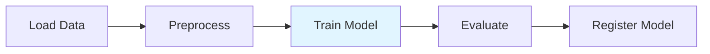
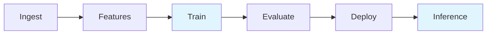

# ML Workflow Guides

Learn how to build common machine learning workflows using Argo Connectors with both YAML and the Hera Python SDK.

## Overview

These guides demonstrate real-world ML workflows using the available connectors in this repository. Each guide includes:

- **Architecture diagram** showing the workflow structure
- **Python (Hera) examples** for programmatic workflows
- **YAML examples** for direct Argo Workflows usage
- **Best practices** for production deployments
- **Real code** using actual Databricks notebooks or Spark jobs

## Available Guides

### [Data Ingestion](data-ingestion.md)
Build data ingestion pipelines to load, validate, and prepare raw data for processing.

**Connectors used**: Databricks

### [Feature Engineering](feature-engineering.md)
Create scalable feature engineering pipelines for ML model training.

**Connectors used**: Databricks, Spark

### [Model Training](model-training.md)
Train machine learning models at scale with distributed compute.

**Connectors used**: Databricks

**Coming soon**: PyTorch, TensorFlow, Ray connectors

### [Batch Inference](batch-inference.md)
Score large datasets with trained models in production.

**Connectors used**: Databricks

### [Multi-Step Pipelines](multi-step-pipelines.md)
Build end-to-end ML pipelines by chaining multiple connectors together.

**Connectors used**: Databricks, Spark

### [Passing Data Between Steps](passing-data-between-steps.md)
Learn how to pass data and parameters between workflow steps.

**Connectors used**: Databricks, Spark

## ML Workflow Patterns

### ETL Pattern


**Guides**: Data Ingestion, Feature Engineering

### Training Pattern


**Guides**: Model Training

### Inference Pattern


**Guides**: Batch Inference

### End-to-End Pipeline


**Guides**: Multi-Step Pipelines

## Choosing the Right Connector

### For Databricks Users
Use the **Databricks connector** when you:
- Already have notebooks in Databricks
- Need managed Spark clusters
- Want serverless compute
- Require Databricks-specific features (Unity Catalog, Delta Lake, etc.)

### For Kubernetes-Native Spark
Use the **Apache Spark connector** when you:
- Want to run Spark entirely on Kubernetes
- Don't need Databricks-specific features
- Have existing Spark JARs or Python scripts
- Prefer open-source tooling

### Combining Connectors
Many workflows use both:
- Databricks for interactive development and notebooks
- Spark for production batch jobs
- Different connectors for different stages of the pipeline

## Best Practices Across All Guides

### 1. Parameterize Everything
Use workflow parameters for configuration:
```python
arguments=[
    Parameter(name="environment", value="production"),
    Parameter(name="date", value="2024-01-01"),
]
```

### 2. Handle Failures
Add retry strategies and error handling to production workflows.

### 3. Monitor Progress
Use workflow outputs to track job progress and results.

### 4. Optimize Resources
Choose appropriate cluster sizes and scaling strategies for your workload.

### 5. Use Version Control
Store your workflow definitions in Git alongside your data/ML code.

## Next Steps

- Start with [Data Ingestion](data-ingestion.md) to build your first pipeline
- Learn about [Passing Data Between Steps](passing-data-between-steps.md) for complex workflows
- Explore [connector documentation](../connectors/README.md) for detailed parameter references
