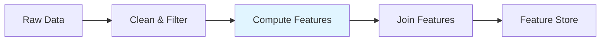

# Feature Engineering Pipeline

Learn how to build scalable feature engineering pipelines using Argo Connectors to transform raw data into ML-ready features.

## Overview

Feature engineering is the process of transforming raw data into features that machine learning models can use. This guide shows you how to build distributed feature engineering pipelines using Databricks and Spark connectors.

## Use Cases

- **Time-based features**: Create rolling windows, lags, and temporal aggregations
- **Aggregations**: Compute customer-level or product-level statistics
- **Encoding**: One-hot encoding, target encoding, embeddings
- **Feature stores**: Build reusable feature pipelines

## Architecture



## Basic Feature Engineering

### Computing Customer Features



```python
from hera.workflows import Workflow, Steps, Step, TemplateRef, Parameter

with Workflow(
    generate_name="feature-engineering-",
    namespace="default",
    entrypoint="main",
    arguments=[
        Parameter(name="input-path", value="s3://data/transactions/"),
        Parameter(name="output-path", value="s3://features/customer-features/"),
        Parameter(name="lookback-days", value="90"),
    ]
) as w:
    with Steps(name="main"):
        Step(
            name="compute-features",
            template_ref=TemplateRef(
                name="databricks-connector",
                template="run-job",
                cluster_scope=False,
            ),
            arguments={
                "code-path": "/Users/ml-team/customer-features",
                "task-type": "notebook",
                "cluster-mode": "New",
                "new-cluster-spark-version": "13.3.x-scala2.12",
                "new-cluster-node-type": "r5.2xlarge",
                "scaling-type": "autoscale",
                "min-workers": "4",
                "max-workers": "16",
                "args": "{{workflow.parameters.input-path}},{{workflow.parameters.output-path}},{{workflow.parameters.lookback-days}}",
            }
        )

w.create()
```



```yaml
apiVersion: argoproj.io/v1alpha1
kind: Workflow
metadata:
  generateName: feature-engineering-
spec:
  entrypoint: main
  arguments:
    parameters:
      - name: input-path
        value: "s3://data/transactions/"
      - name: output-path
        value: "s3://features/customer-features/"
      - name: lookback-days
        value: "90"
  
  templates:
    - name: main
      steps:
        - - name: compute-features
            templateRef:
              name: databricks-connector
              template: run-job
            arguments:
              parameters:
                - name: code-path
                  value: "/Users/ml-team/customer-features"
                - name: task-type
                  value: "notebook"
                - name: cluster-mode
                  value: "New"
                - name: new-cluster-spark-version
                  value: "13.3.x-scala2.12"
                - name: new-cluster-node-type
                  value: "r5.2xlarge"
                - name: scaling-type
                  value: "autoscale"
                - name: min-workers
                  value: "4"
                - name: max-workers
                  value: "16"
                - name: args
                  value: "{{workflow.parameters.input-path}},{{workflow.parameters.output-path}},{{workflow.parameters.lookback-days}}"
```



### Databricks Notebook: Customer Features

```python
# Databricks notebook: /Users/ml-team/customer-features

# COMMAND ----------
dbutils.widgets.text("input_path", "")
dbutils.widgets.text("output_path", "")
dbutils.widgets.text("lookback_days", "90")

input_path = dbutils.widgets.get("input_path")
output_path = dbutils.widgets.get("output_path")
lookback_days = int(dbutils.widgets.get("lookback_days"))

# COMMAND ----------
from pyspark.sql import functions as F
from pyspark.sql.window import Window
from datetime import datetime, timedelta

# Load transaction data
df_transactions = spark.read.parquet(input_path)

# Filter to lookback period
cutoff_date = datetime.now() - timedelta(days=lookback_days)
df_recent = df_transactions.filter(F.col("transaction_date") >= cutoff_date)

print(f"Transactions in last {lookback_days} days: {df_recent.count():,}")

# COMMAND ----------
# Compute aggregation features
customer_features = df_recent.groupBy("customer_id").agg(
    # Transaction counts
    F.count("*").alias("transaction_count"),
    F.countDistinct("product_id").alias("unique_products"),
    
    # Monetary features
    F.sum("amount").alias("total_spend"),
    F.avg("amount").alias("avg_transaction_value"),
    F.max("amount").alias("max_transaction_value"),
    F.min("amount").alias("min_transaction_value"),
    F.stddev("amount").alias("stddev_transaction_value"),
    
    # Temporal features
    F.max("transaction_date").alias("last_transaction_date"),
    F.min("transaction_date").alias("first_transaction_date"),
)

# COMMAND ----------
# Compute derived features
customer_features = customer_features.withColumn(
    "avg_days_between_purchases",
    F.datediff(F.col("last_transaction_date"), F.col("first_transaction_date")) /
    F.when(F.col("transaction_count") > 1, F.col("transaction_count") - 1).otherwise(F.lit(None))
).withColumn(
    "days_since_last_purchase",
    F.datediff(F.current_date(), F.col("last_transaction_date"))
)

# COMMAND ----------
# Add window-based features (percentile ranks)
window = Window.orderBy("total_spend")

customer_features = customer_features.withColumn(
    "spend_percentile",
    F.percent_rank().over(window)
)

# COMMAND ----------
# Save features
(customer_features.write
    .mode("overwrite")
    .parquet(output_path))

print(f"Saved features for {customer_features.count():,} customers to {output_path}")
```

## Advanced: Multi-Stage Feature Pipeline

Build features in stages for complex transformations:



```python
from hera.workflows import Workflow, Steps, Step, TemplateRef, Parameter

with Workflow(
    generate_name="multi-stage-features-",
    namespace="default",
    entrypoint="main",
    arguments=[
        Parameter(name="date", value="2024-01-01"),
    ]
) as w:
    with Steps(name="main"):
        # Stage 1: Raw aggregations
        Step(
            name="raw-aggregations",
            template_ref=TemplateRef(
                name="databricks-connector",
                template="run-job",
                cluster_scope=False,
            ),
            arguments={
                "code-path": "/Users/ml-team/01-raw-aggregations",
                "task-type": "notebook",
                "cluster-mode": "New",
                "new-cluster-spark-version": "13.3.x-scala2.12",
                "new-cluster-node-type": "r5.xlarge",
                "scaling-type": "autoscale",
                "min-workers": "3",
                "max-workers": "12",
                "args": "{{workflow.parameters.date}}",
            }
        )
        
        # Stage 2: Time-series features
        Step(
            name="time-series-features",
            template_ref=TemplateRef(
                name="databricks-connector",
                template="run-job",
                cluster_scope=False,
            ),
            arguments={
                "code-path": "/Users/ml-team/02-time-series-features",
                "task-type": "notebook",
                "cluster-mode": "New",
                "new-cluster-spark-version": "13.3.x-scala2.12",
                "new-cluster-node-type": "r5.xlarge",
                "scaling-type": "autoscale",
                "min-workers": "3",
                "max-workers": "12",
                "args": "{{workflow.parameters.date}}",
            }
        )
        
        # Stage 3: Join and finalize
        Step(
            name="join-features",
            template_ref=TemplateRef(
                name="databricks-connector",
                template="run-job",
                cluster_scope=False,
            ),
            arguments={
                "code-path": "/Users/ml-team/03-join-features",
                "task-type": "notebook",
                "cluster-mode": "Serverless",
                "args": "{{workflow.parameters.date}}",
            }
        )

w.create()
```



```yaml
apiVersion: argoproj.io/v1alpha1
kind: Workflow
metadata:
  generateName: multi-stage-features-
spec:
  entrypoint: main
  arguments:
    parameters:
      - name: date
        value: "2024-01-01"
  
  templates:
    - name: main
      steps:
        # Stage 1: Raw aggregations
        - - name: raw-aggregations
            templateRef:
              name: databricks-connector
              template: run-job
            arguments:
              parameters:
                - name: code-path
                  value: "/Users/ml-team/01-raw-aggregations"
                - name: task-type
                  value: "notebook"
                - name: cluster-mode
                  value: "New"
                - name: new-cluster-spark-version
                  value: "13.3.x-scala2.12"
                - name: new-cluster-node-type
                  value: "r5.xlarge"
                - name: scaling-type
                  value: "autoscale"
                - name: min-workers
                  value: "3"
                - name: max-workers
                  value: "12"
                - name: args
                  value: "{{workflow.parameters.date}}"
        
        # Stage 2: Time-series features
        - - name: time-series-features
            templateRef:
              name: databricks-connector
              template: run-job
            arguments:
              parameters:
                - name: code-path
                  value: "/Users/ml-team/02-time-series-features"
                - name: task-type
                  value: "notebook"
                - name: cluster-mode
                  value: "New"
                - name: new-cluster-spark-version
                  value: "13.3.x-scala2.12"
                - name: new-cluster-node-type
                  value: "r5.xlarge"
                - name: scaling-type
                  value: "autoscale"
                - name: min-workers
                  value: "3"
                - name: max-workers
                  value: "12"
                - name: args
                  value: "{{workflow.parameters.date}}"
        
        # Stage 3: Join and finalize
        - - name: join-features
            templateRef:
              name: databricks-connector
              template: run-job
            arguments:
              parameters:
                - name: code-path
                  value: "/Users/ml-team/03-join-features"
                - name: task-type
                  value: "notebook"
                - name: cluster-mode
                  value: "Serverless"
                - name: args
                  value: "{{workflow.parameters.date}}"
```



## Best Practices

### 1. Use Memory-Optimized Instances
Feature engineering often involves aggregations:
```python
arguments={
    "new-cluster-node-type": "r5.2xlarge",  # Memory-optimized
}
```

### 2. Cache Intermediate Results
For iterative feature development:
```python
# In your notebook
df_features.cache()
df_features.count()  # Materialize cache
```

### 3. Monitor Feature Distributions
Check for data drift:
```python
# Summary statistics
df_features.describe().show()

# Check for nulls
df_features.select([F.sum(F.col(c).isNull().cast("int")).alias(c) 
                    for c in df_features.columns]).show()
```

## Next Steps

- [Model Training](model-training.md) - Train models with your engineered features
- [Batch Inference](batch-inference.md) - Use features for predictions
- [Data Ingestion](data-ingestion.md) - Load raw data for feature engineering
- [Multi-Step Pipelines](multi-step-pipelines.md) - Build end-to-end workflows
