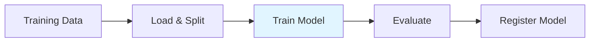

# Model Training Pipeline

Learn how to build scalable model training pipelines using Argo Connectors to train machine learning models with distributed compute.

## Overview

Model training involves fitting ML models to your data. This guide shows you how to build training pipelines that scale from experimentation to production using available connectors.

## Use Cases

- **Training at scale**: Train models on large datasets with distributed computing
- **Hyperparameter tuning**: Run multiple training jobs with different configurations
- **Model comparison**: Train multiple model types in parallel
- **Scheduled retraining**: Automatically retrain models on new data

## Architecture



## Basic Model Training

### Train with Databricks and MLflow



```python
from hera.workflows import Workflow, Steps, Step, TemplateRef, Parameter

with Workflow(
    generate_name="model-training-",
    namespace="default",
    entrypoint="main",
    arguments=[
        Parameter(name="training-data", value="s3://ml-data/features/2024-01-01/"),
        Parameter(name="model-name", value="churn-prediction"),
        Parameter(name="experiment-name", value="/Shared/experiments/churn"),
    ]
) as w:
    with Steps(name="main"):
        Step(
            name="train-model",
            template_ref=TemplateRef(
                name="databricks-connector",
                template="run-job",
                cluster_scope=False,
            ),
            arguments={
                "code-path": "/Users/ml-team/train-churn-model",
                "task-type": "notebook",
                "cluster-mode": "New",
                
                # Use larger instances for training
                "new-cluster-spark-version": "13.3.x-scala2.12",
                "new-cluster-node-type": "r5.4xlarge",
                "new-cluster-num-workers": "4",
                
                # Pass training configuration
                "args": "{{workflow.parameters.training-data}},{{workflow.parameters.model-name}},{{workflow.parameters.experiment-name}}",
            }
        )

w.create()
```



```yaml
apiVersion: argoproj.io/v1alpha1
kind: Workflow
metadata:
  generateName: model-training-
spec:
  entrypoint: main
  arguments:
    parameters:
      - name: training-data
        value: "s3://ml-data/features/2024-01-01/"
      - name: model-name
        value: "churn-prediction"
      - name: experiment-name
        value: "/Shared/experiments/churn"
  
  templates:
    - name: main
      steps:
        - - name: train-model
            templateRef:
              name: databricks-connector
              template: run-job
            arguments:
              parameters:
                - name: code-path
                  value: "/Users/ml-team/train-churn-model"
                - name: task-type
                  value: "notebook"
                - name: cluster-mode
                  value: "New"
                - name: new-cluster-spark-version
                  value: "13.3.x-scala2.12"
                - name: new-cluster-node-type
                  value: "r5.4xlarge"
                - name: new-cluster-num-workers
                  value: "4"
                - name: args
                  value: "{{workflow.parameters.training-data}},{{workflow.parameters.model-name}},{{workflow.parameters.experiment-name}}"
```



### Databricks Notebook: Train Model

```python
# Databricks notebook: /Users/ml-team/train-churn-model

# COMMAND ----------
dbutils.widgets.text("training_data", "")
dbutils.widgets.text("model_name", "")
dbutils.widgets.text("experiment_name", "")

training_data = dbutils.widgets.get("training_data")
model_name = dbutils.widgets.get("model_name")
experiment_name = dbutils.widgets.get("experiment_name")

# COMMAND ----------
import mlflow
import mlflow.sklearn
from sklearn.ensemble import RandomForestClassifier
from sklearn.model_selection import train_test_split
from sklearn.metrics import accuracy_score, precision_score, recall_score, f1_score

# Set MLflow experiment
mlflow.set_experiment(experiment_name)

# COMMAND ----------
# Load training data
df = spark.read.parquet(training_data)
df_pandas = df.toPandas()

# Prepare features and target
X = df_pandas.drop(['customer_id', 'churned'], axis=1)
y = df_pandas['churned']

X_train, X_test, y_train, y_test = train_test_split(
    X, y, test_size=0.2, random_state=42
)

print(f"Training samples: {len(X_train):,}")
print(f"Test samples: {len(X_test):,}")

# COMMAND ----------
# Train model with MLflow tracking
with mlflow.start_run(run_name=f"{model_name}-training"):
    # Log parameters
    n_estimators = 100
    max_depth = 10
    
    mlflow.log_param("n_estimators", n_estimators)
    mlflow.log_param("max_depth", max_depth)
    mlflow.log_param("training_samples", len(X_train))
    
    # Train model
    model = RandomForestClassifier(
        n_estimators=n_estimators,
        max_depth=max_depth,
        random_state=42
    )
    model.fit(X_train, y_train)
    
    # Evaluate
    y_pred = model.predict(X_test)
    
    accuracy = accuracy_score(y_test, y_pred)
    precision = precision_score(y_test, y_pred)
    recall = recall_score(y_test, y_pred)
    f1 = f1_score(y_test, y_pred)
    
    # Log metrics
    mlflow.log_metric("accuracy", accuracy)
    mlflow.log_metric("precision", precision)
    mlflow.log_metric("recall", recall)
    mlflow.log_metric("f1_score", f1)
    
    print(f"Accuracy: {accuracy:.4f}")
    print(f"Precision: {precision:.4f}")
    print(f"Recall: {recall:.4f}")
    print(f"F1 Score: {f1:.4f}")
    
    # Log model
    mlflow.sklearn.log_model(model, "model")
    
    # Register model
    model_uri = f"runs:/{mlflow.active_run().info.run_id}/model"
    mlflow.register_model(model_uri, model_name)
    
    print(f"Model registered as: {model_name}")
```

## GPU-Accelerated Training

> **Note**: This example demonstrates the pattern. The PyTorch and TensorFlow connectors are coming soon. For now, use Databricks with GPU instances.

### Deep Learning with GPU Instances



```python
from hera.workflows import Workflow, Steps, Step, TemplateRef, Parameter

with Workflow(
    generate_name="gpu-training-",
    namespace="default",
    entrypoint="main",
    arguments=[
        Parameter(name="training-data", value="s3://ml-data/images/"),
        Parameter(name="model-name", value="image-classifier"),
    ]
) as w:
    with Steps(name="main"):
        Step(
            name="train-on-gpu",
            template_ref=TemplateRef(
                name="databricks-connector",
                template="run-job",
                cluster_scope=False,
            ),
            arguments={
                "code-path": "/Users/ml-team/train-image-model",
                "task-type": "notebook",
                "cluster-mode": "New",
                
                # GPU-enabled Databricks Runtime
                "new-cluster-spark-version": "13.3.x-gpu-ml-scala2.12",
                "new-cluster-node-type": "g4dn.xlarge",  # 1 T4 GPU
                "new-cluster-num-workers": "2",
                
                "args": "{{workflow.parameters.training-data}},{{workflow.parameters.model-name}}",
            }
        )

w.create()
```



```yaml
apiVersion: argoproj.io/v1alpha1
kind: Workflow
metadata:
  generateName: gpu-training-
spec:
  entrypoint: main
  arguments:
    parameters:
      - name: training-data
        value: "s3://ml-data/images/"
      - name: model-name
        value: "image-classifier"
  
  templates:
    - name: main
      steps:
        - - name: train-on-gpu
            templateRef:
              name: databricks-connector
              template: run-job
            arguments:
              parameters:
                - name: code-path
                  value: "/Users/ml-team/train-image-model"
                - name: task-type
                  value: "notebook"
                - name: cluster-mode
                  value: "New"
                - name: new-cluster-spark-version
                  value: "13.3.x-gpu-ml-scala2.12"
                - name: new-cluster-node-type
                  value: "g4dn.xlarge"
                - name: new-cluster-num-workers
                  value: "2"
                - name: args
                  value: "{{workflow.parameters.training-data}},{{workflow.parameters.model-name}}"
```



> **Coming Soon**: Dedicated PyTorch, TensorFlow, and Ray connectors for distributed training

## Hyperparameter Tuning

Run multiple training jobs with different hyperparameters:



```python
from hera.workflows import Workflow, Steps, Step, TemplateRef, Parameter

# Hyperparameter configurations
configs = [
    {"n_estimators": "100", "max_depth": "10"},
    {"n_estimators": "200", "max_depth": "15"},
    {"n_estimators": "300", "max_depth": "20"},
]

with Workflow(
    generate_name="hyperparameter-tuning-",
    namespace="default",
    entrypoint="main",
    arguments=[
        Parameter(name="training-data", value="s3://ml-data/features/"),
    ]
) as w:
    with Steps(name="main") as s:
        # Train models in parallel with different configs
        with s.parallel():
            for i, config in enumerate(configs):
                Step(
                    name=f"train-config-{i}",
                    template_ref=TemplateRef(
                        name="databricks-connector",
                        template="run-job",
                        cluster_scope=False,
                    ),
                    arguments={
                        "code-path": "/Users/ml-team/train-with-config",
                        "task-type": "notebook",
                        "cluster-mode": "New",
                        "new-cluster-spark-version": "13.3.x-scala2.12",
                        "new-cluster-node-type": "r5.2xlarge",
                        "new-cluster-num-workers": "2",
                        "args": f"{{{{workflow.parameters.training-data}}}},{config['n_estimators']},{config['max_depth']}",
                    }
                )

w.create()
```



```yaml
apiVersion: argoproj.io/v1alpha1
kind: Workflow
metadata:
  generateName: hyperparameter-tuning-
spec:
  entrypoint: main
  arguments:
    parameters:
      - name: training-data
        value: "s3://ml-data/features/"
  
  templates:
    - name: main
      steps:
        # Train models in parallel
        - - name: train-config-0
            templateRef:
              name: databricks-connector
              template: run-job
            arguments:
              parameters:
                - name: code-path
                  value: "/Users/ml-team/train-with-config"
                - name: task-type
                  value: "notebook"
                - name: cluster-mode
                  value: "New"
                - name: new-cluster-spark-version
                  value: "13.3.x-scala2.12"
                - name: new-cluster-node-type
                  value: "r5.2xlarge"
                - name: new-cluster-num-workers
                  value: "2"
                - name: args
                  value: "{{workflow.parameters.training-data}},100,10"
          
          - name: train-config-1
            templateRef:
              name: databricks-connector
              template: run-job
            arguments:
              parameters:
                - name: code-path
                  value: "/Users/ml-team/train-with-config"
                - name: task-type
                  value: "notebook"
                - name: cluster-mode
                  value: "New"
                - name: new-cluster-spark-version
                  value: "13.3.x-scala2.12"
                - name: new-cluster-node-type
                  value: "r5.2xlarge"
                - name: new-cluster-num-workers
                  value: "2"
                - name: args
                  value: "{{workflow.parameters.training-data}},200,15"
          
          - name: train-config-2
            templateRef:
              name: databricks-connector
              template: run-job
            arguments:
              parameters:
                - name: code-path
                  value: "/Users/ml-team/train-with-config"
                - name: task-type
                  value: "notebook"
                - name: cluster-mode
                  value: "New"
                - name: new-cluster-spark-version
                  value: "13.3.x-scala2.12"
                - name: new-cluster-node-type
                  value: "r5.2xlarge"
                - name: new-cluster-num-workers
                  value: "2"
                - name: args
                  value: "{{workflow.parameters.training-data}},300,20"



## Best Practices

### 1. Use MLflow for Experiment Tracking
Track all experiments in your training notebooks:
```python
import mlflow

with mlflow.start_run():
    mlflow.log_params(params)
    mlflow.log_metrics(metrics)
    mlflow.log_model(model, "model")
```

### 2. Split Data Properly
Use consistent random seeds for reproducibility:
```python
train, test = df.randomSplit([0.8, 0.2], seed=42)
```

### 3. Monitor Training Progress
Log intermediate metrics:
```python
for epoch in range(num_epochs):
    # Training code
    mlflow.log_metric("train_loss", loss, step=epoch)
```

### 4. Save Model Artifacts
Use MLflow to version models:
```python
mlflow.register_model(model_uri, model_name)
```

## Coming Soon

The following connectors will enable additional training workflows:

### PyTorch Connector
Train deep learning models with PyTorch:
- Distributed training across multiple GPUs
- Integration with PyTorch Lightning
- Automatic checkpoint management

### TensorFlow Connector
Train neural networks with TensorFlow:
- TensorFlow Distributed training
- TensorBoard integration
- Model serving preparation

### Ray Connector
Scalable hyperparameter tuning:
- Ray Tune for hyperparameter search
- Distributed training with Ray Train
- Automatic resource allocation

### Weights & Biases Connector
Enhanced experiment tracking:
- Automatic logging and visualization
- Model versioning
- Collaboration features

## Next Steps

- [Batch Inference](batch-inference.md) - Use trained models for predictions
- [Feature Engineering](feature-engineering.md) - Prepare data for training
- [Multi-Step Pipelines](multi-step-pipelines.md) - Build end-to-end ML workflows
- [Databricks Examples](../connectors/databricks/hera-examples.md) - More patterns
