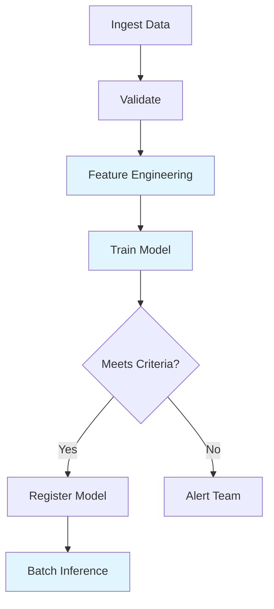

# Multi-Step Pipelines

Learn how to build end-to-end ML pipelines by chaining multiple connectors and workflow steps together.

## Overview

Real-world ML workflows typically involve multiple stages: data ingestion, feature engineering, model training, evaluation, and deployment. This guide shows you how to orchestrate these stages into cohesive pipelines.

## Use Cases

- **End-to-end ML pipelines**: From raw data to production models
- **Multi-stage processing**: Sequential data transformations
- **Conditional workflows**: Different paths based on results
- **Parallel processing**: Run independent tasks simultaneously

## Architecture



## Complete ML Pipeline

### From Data to Production Model



```python
from hera.workflows import Workflow, Steps, Step, TemplateRef, Parameter
from datetime import datetime

today = datetime.now().strftime("%Y-%m-%d")

with Workflow(
    generate_name="ml-pipeline-",
    namespace="default",
    entrypoint="main",
    arguments=[
        Parameter(name="date", value=today),
        Parameter(name="model-name", value="churn-predictor"),
    ]
) as w:
    with Steps(name="main"):
        # Step 1: Data Ingestion
        Step(
            name="ingest-data",
            template_ref=TemplateRef(
                name="databricks-connector",
                template="run-job",
                cluster_scope=False,
            ),
            arguments={
                "code-path": "/Users/data-team/01-ingest",
                "task-type": "notebook",
                "cluster-mode": "Serverless",
                "run-name": "ingest-{{workflow.parameters.date}}",
                "args": "{{workflow.parameters.date}}",
            }
        )
        
        # Step 2: Data Validation
        Step(
            name="validate-data",
            template_ref=TemplateRef(
                name="databricks-connector",
                template="run-job",
                cluster_scope=False,
            ),
            arguments={
                "code-path": "/Users/data-team/02-validate",
                "task-type": "notebook",
                "cluster-mode": "Serverless",
                "run-name": "validate-{{workflow.parameters.date}}",
                "args": "{{workflow.parameters.date}}",
            }
        )
        
        # Step 3: Feature Engineering
        Step(
            name="feature-engineering",
            template_ref=TemplateRef(
                name="databricks-connector",
                template="run-job",
                cluster_scope=False,
            ),
            arguments={
                "code-path": "/Users/ml-team/03-features",
                "task-type": "notebook",
                "cluster-mode": "New",
                "new-cluster-spark-version": "13.3.x-scala2.12",
                "new-cluster-node-type": "r5.2xlarge",
                "scaling-type": "autoscale",
                "min-workers": "4",
                "max-workers": "16",
                "run-name": "features-{{workflow.parameters.date}}",
                "args": "{{workflow.parameters.date}}",
            }
        )
        
        # Step 4: Model Training
        Step(
            name="train-model",
            template_ref=TemplateRef(
                name="databricks-connector",
                template="run-job",
                cluster_scope=False,
            ),
            arguments={
                "code-path": "/Users/ml-team/04-train",
                "task-type": "notebook",
                "cluster-mode": "New",
                "new-cluster-spark-version": "13.3.x-scala2.12",
                "new-cluster-node-type": "r5.4xlarge",
                "new-cluster-num-workers": "4",
                "run-name": "train-{{workflow.parameters.date}}",
                "args": "{{workflow.parameters.date}},{{workflow.parameters.model-name}}",
            }
        )
        
        # Step 5: Model Evaluation
        Step(
            name="evaluate-model",
            template_ref=TemplateRef(
                name="databricks-connector",
                template="run-job",
                cluster_scope=False,
            ),
            arguments={
                "code-path": "/Users/ml-team/05-evaluate",
                "task-type": "notebook",
                "cluster-mode": "Serverless",
                "run-name": "evaluate-{{workflow.parameters.date}}",
                "args": "{{workflow.parameters.model-name}}",
            }
        )
        
        # Step 6: Batch Inference (production deployment)
        Step(
            name="batch-inference",
            template_ref=TemplateRef(
                name="databricks-connector",
                template="run-job",
                cluster_scope=False,
            ),
            arguments={
                "code-path": "/Users/ml-team/06-inference",
                "task-type": "notebook",
                "cluster-mode": "New",
                "new-cluster-spark-version": "13.3.x-scala2.12",
                "new-cluster-node-type": "r5.2xlarge",
                "scaling-type": "autoscale",
                "min-workers": "5",
                "max-workers": "20",
                "run-name": "inference-{{workflow.parameters.date}}",
                "args": "{{workflow.parameters.model-name}},{{workflow.parameters.date}}",
            }
        )

w.create()
```



```yaml
apiVersion: argoproj.io/v1alpha1
kind: Workflow
metadata:
  generateName: ml-pipeline-
spec:
  entrypoint: main
  arguments:
    parameters:
      - name: date
        value: "2024-01-01"
      - name: model-name
        value: "churn-predictor"
  
  templates:
    - name: main
      steps:
        # Step 1: Data Ingestion
        - - name: ingest-data
            templateRef:
              name: databricks-connector
              template: run-job
            arguments:
              parameters:
                - name: code-path
                  value: "/Users/data-team/01-ingest"
                - name: task-type
                  value: "notebook"
                - name: cluster-mode
                  value: "Serverless"
                - name: run-name
                  value: "ingest-{{workflow.parameters.date}}"
                - name: args
                  value: "{{workflow.parameters.date}}"
        
        # Step 2: Data Validation
        - - name: validate-data
            templateRef:
              name: databricks-connector
              template: run-job
            arguments:
              parameters:
                - name: code-path
                  value: "/Users/data-team/02-validate"
                - name: task-type
                  value: "notebook"
                - name: cluster-mode
                  value: "Serverless"
                - name: run-name
                  value: "validate-{{workflow.parameters.date}}"
                - name: args
                  value: "{{workflow.parameters.date}}"
        
        # Step 3: Feature Engineering
        - - name: feature-engineering
            templateRef:
              name: databricks-connector
              template: run-job
            arguments:
              parameters:
                - name: code-path
                  value: "/Users/ml-team/03-features"
                - name: task-type
                  value: "notebook"
                - name: cluster-mode
                  value: "New"
                - name: new-cluster-spark-version
                  value: "13.3.x-scala2.12"
                - name: new-cluster-node-type
                  value: "r5.2xlarge"
                - name: scaling-type
                  value: "autoscale"
                - name: min-workers
                  value: "4"
                - name: max-workers
                  value: "16"
                - name: run-name
                  value: "features-{{workflow.parameters.date}}"
                - name: args
                  value: "{{workflow.parameters.date}}"
        
        # Step 4: Model Training
        - - name: train-model
            templateRef:
              name: databricks-connector
              template: run-job
            arguments:
              parameters:
                - name: code-path
                  value: "/Users/ml-team/04-train"
                - name: task-type
                  value: "notebook"
                - name: cluster-mode
                  value: "New"
                - name: new-cluster-spark-version
                  value: "13.3.x-scala2.12"
                - name: new-cluster-node-type
                  value: "r5.4xlarge"
                - name: new-cluster-num-workers
                  value: "4"
                - name: run-name
                  value: "train-{{workflow.parameters.date}}"
                - name: args
                  value: "{{workflow.parameters.date}},{{workflow.parameters.model-name}}"
        
        # Step 5: Model Evaluation
        - - name: evaluate-model
            templateRef:
              name: databricks-connector
              template: run-job
            arguments:
              parameters:
                - name: code-path
                  value: "/Users/ml-team/05-evaluate"
                - name: task-type
                  value: "notebook"
                - name: cluster-mode
                  value: "Serverless"
                - name: run-name
                  value: "evaluate-{{workflow.parameters.date}}"
                - name: args
                  value: "{{workflow.parameters.model-name}}"
        
        # Step 6: Batch Inference
        - - name: batch-inference
            templateRef:
              name: databricks-connector
              template: run-job
            arguments:
              parameters:
                - name: code-path
                  value: "/Users/ml-team/06-inference"
                - name: task-type
                  value: "notebook"
                - name: cluster-mode
                  value: "New"
                - name: new-cluster-spark-version
                  value: "13.3.x-scala2.12"
                - name: new-cluster-node-type
                  value: "r5.2xlarge"
                - name: scaling-type
                  value: "autoscale"
                - name: min-workers
                  value: "5"
                - name: max-workers
                  value: "20"
                - name: run-name
                  value: "inference-{{workflow.parameters.date}}"
                - name: args
                  value: "{{workflow.parameters.model-name}},{{workflow.parameters.date}}"
```



## Combining Databricks and Spark Connectors

Use Databricks for development and Spark for production jobs:



```python
from hera.workflows import Workflow, Steps, Step, TemplateRef, Parameter

with Workflow(
    generate_name="hybrid-pipeline-",
    namespace="default",
    entrypoint="main"
) as w:
    with Steps(name="main"):
        # Use Databricks for feature engineering (interactive development)
        Step(
            name="feature-engineering",
            template_ref=TemplateRef(
                name="databricks-connector",
                template="run-job",
                cluster_scope=False,
            ),
            arguments={
                "code-path": "/Users/ml-team/feature-engineering",
                "task-type": "notebook",
                "cluster-mode": "New",
                "new-cluster-spark-version": "13.3.x-scala2.12",
                "new-cluster-node-type": "r5.xlarge",
                "new-cluster-num-workers": "3",
            }
        )
        
        # Use Spark on K8s for production batch job
        Step(
            name="batch-processing",
            template_ref=TemplateRef(
                name="spark-data-connector-jvm",
                template="spark",
                cluster_scope=False,
            ),
            arguments={
                "type": "Scala",
                "mainClass": "com.company.BatchProcessor",
                "mainApplicationFile": "s3://jars/batch-processor.jar",
                "namespace": "default",
                "globalImage": "gcr.io/spark-operator/spark:v3.1.1",
                "executorInstances": "10",
                "driverMemory": "4096m",
                "executorMemory": "8192m",
            }
        )

w.create()
```



```yaml
apiVersion: argoproj.io/v1alpha1
kind: Workflow
metadata:
  generateName: hybrid-pipeline-
spec:
  entrypoint: main
  templates:
    - name: main
      steps:
        # Use Databricks for feature engineering
        - - name: feature-engineering
            templateRef:
              name: databricks-connector
              template: run-job
            arguments:
              parameters:
                - name: code-path
                  value: "/Users/ml-team/feature-engineering"
                - name: task-type
                  value: "notebook"
                - name: cluster-mode
                  value: "New"
                - name: new-cluster-spark-version
                  value: "13.3.x-scala2.12"
                - name: new-cluster-node-type
                  value: "r5.xlarge"
                - name: new-cluster-num-workers
                  value: "3"
        
        # Use Spark on K8s for production batch
        - - name: batch-processing
            templateRef:
              name: spark-data-connector-jvm
              template: spark
            arguments:
              parameters:
                - name: type
                  value: "Scala"
                - name: mainClass
                  value: "com.company.BatchProcessor"
                - name: mainApplicationFile
                  value: "s3://jars/batch-processor.jar"
                - name: namespace
                  value: "default"
                - name: globalImage
                  value: "gcr.io/spark-operator/spark:v3.1.1"
                - name: executorInstances
                  value: "10"
                - name: driverMemory
                  value: "4096m"
                - name: executorMemory
                  value: "8192m"
```



## Scheduled Daily ML Pipeline

Run your pipeline on a schedule using Argo's CronWorkflow:



```python
from hera.workflows import CronWorkflow, Steps, Step, TemplateRef, Parameter
from datetime import datetime

with CronWorkflow(
    name="daily-ml-pipeline",
    namespace="default",
    entrypoint="main",
    schedule="0 2 * * *",  # Daily at 2 AM
    timezone="America/New_York",
    arguments=[
        Parameter(name="model-name", value="daily-churn-model"),
    ]
) as w:
    with Steps(name="main"):
        # Ingest yesterday's data
        Step(
            name="ingest",
            template_ref=TemplateRef(
                name="databricks-connector",
                template="run-job",
                cluster_scope=False,
            ),
            arguments={
                "code-path": "/Users/data-team/daily-ingest",
                "task-type": "notebook",
                "cluster-mode": "Serverless",
            }
        )
        
        # Feature engineering
        Step(
            name="features",
            template_ref=TemplateRef(
                name="databricks-connector",
                template="run-job",
                cluster_scope=False,
            ),
            arguments={
                "code-path": "/Users/ml-team/daily-features",
                "task-type": "notebook",
                "cluster-mode": "New",
                "new-cluster-spark-version": "13.3.x-scala2.12",
                "new-cluster-node-type": "r5.xlarge",
                "scaling-type": "autoscale",
                "min-workers": "2",
                "max-workers": "8",
            }
        )
        
        # Train model
        Step(
            name="train",
            template_ref=TemplateRef(
                name="databricks-connector",
                template="run-job",
                cluster_scope=False,
            ),
            arguments={
                "code-path": "/Users/ml-team/daily-train",
                "task-type": "notebook",
                "cluster-mode": "New",
                "new-cluster-spark-version": "13.3.x-scala2.12",
                "new-cluster-node-type": "r5.2xlarge",
                "new-cluster-num-workers": "3",
                "args": "{{workflow.parameters.model-name}}",
            }
        )

w.create()
```



```yaml
apiVersion: argoproj.io/v1alpha1
kind: CronWorkflow
metadata:
  name: daily-ml-pipeline
spec:
  schedule: "0 2 * * *"  # Daily at 2 AM
  timezone: "America/New_York"
  workflowSpec:
    entrypoint: main
    arguments:
      parameters:
        - name: model-name
          value: "daily-churn-model"
    
    templates:
      - name: main
        steps:
          # Ingest yesterday's data
          - - name: ingest
              templateRef:
                name: databricks-connector
                template: run-job
              arguments:
                parameters:
                  - name: code-path
                    value: "/Users/data-team/daily-ingest"
                  - name: task-type
                    value: "notebook"
                  - name: cluster-mode
                    value: "Serverless"
          
          # Feature engineering
          - - name: features
              templateRef:
                name: databricks-connector
                template: run-job
              arguments:
                parameters:
                  - name: code-path
                    value: "/Users/ml-team/daily-features"
                  - name: task-type
                    value: "notebook"
                  - name: cluster-mode
                    value: "New"
                  - name: new-cluster-spark-version
                    value: "13.3.x-scala2.12"
                  - name: new-cluster-node-type
                    value: "r5.xlarge"
                  - name: scaling-type
                    value: "autoscale"
                  - name: min-workers
                    value: "2"
                  - name: max-workers
                    value: "8"
          
          # Train model
          - - name: train
              templateRef:
                name: databricks-connector
                template: run-job
              arguments:
                parameters:
                  - name: code-path
                    value: "/Users/ml-team/daily-train"
                  - name: task-type
                    value: "notebook"
                  - name: cluster-mode
                    value: "New"
                  - name: new-cluster-spark-version
                    value: "13.3.x-scala2.12"
                  - name: new-cluster-node-type
                    value: "r5.2xlarge"
                  - name: new-cluster-num-workers
                    value: "3"
                  - name: args
                    value: "{{workflow.parameters.model-name}}"
```



## Parallel Processing

Process multiple entities in parallel for faster pipelines:



```python
from hera.workflows import Workflow, Steps, Step, TemplateRef, Parameter

regions = ["us-west", "us-east", "eu-west", "ap-south"]

with Workflow(
    generate_name="regional-pipeline-",
    namespace="default",
    entrypoint="main"
) as w:
    with Steps(name="main") as s:
        # Process each region in parallel
        with s.parallel():
            for region in regions:
                Step(
                    name=f"process-{region}",
                    template_ref=TemplateRef(
                        name="databricks-connector",
                        template="run-job",
                        cluster_scope=False,
                    ),
                    arguments={
                        "code-path": "/Users/ml-team/regional-processing",
                        "task-type": "notebook",
                        "cluster-mode": "New",
                        "new-cluster-spark-version": "13.3.x-scala2.12",
                        "new-cluster-node-type": "i3.xlarge",
                        "new-cluster-num-workers": "3",
                        "args": region,
                    }
                )
        
        # Aggregate results from all regions
        Step(
            name="aggregate-regions",
            template_ref=TemplateRef(
                name="databricks-connector",
                template="run-job",
                cluster_scope=False,
            ),
            arguments={
                "code-path": "/Users/ml-team/aggregate-all",
                "task-type": "notebook",
                "cluster-mode": "Serverless",
            }
        )

w.create()
```



```yaml
apiVersion: argoproj.io/v1alpha1
kind: Workflow
metadata:
  generateName: regional-pipeline-
spec:
  entrypoint: main
  templates:
    - name: main
      steps:
        # Process each region in parallel
        - - name: process-us-west
            templateRef:
              name: databricks-connector
              template: run-job
            arguments:
              parameters:
                - name: code-path
                  value: "/Users/ml-team/regional-processing"
                - name: task-type
                  value: "notebook"
                - name: cluster-mode
                  value: "New"
                - name: new-cluster-spark-version
                  value: "13.3.x-scala2.12"
                - name: new-cluster-node-type
                  value: "i3.xlarge"
                - name: new-cluster-num-workers
                  value: "3"
                - name: args
                  value: "us-west"
          
          - name: process-us-east
            templateRef:
              name: databricks-connector
              template: run-job
            arguments:
              parameters:
                - name: code-path
                  value: "/Users/ml-team/regional-processing"
                - name: task-type
                  value: "notebook"
                - name: cluster-mode
                  value: "New"
                - name: new-cluster-spark-version
                  value: "13.3.x-scala2.12"
                - name: new-cluster-node-type
                  value: "i3.xlarge"
                - name: new-cluster-num-workers
                  value: "3"
                - name: args
                  value: "us-east"
          
          # ... other regions ...
        
        # Aggregate results
        - - name: aggregate-regions
            templateRef:
              name: databricks-connector
              template: run-job
            arguments:
              parameters:
                - name: code-path
                  value: "/Users/ml-team/aggregate-all"
                - name: task-type
                  value: "notebook"
                - name: cluster-mode
                  value: "Serverless"
```



## Best Practices

### 1. Use Appropriate Cluster Sizes per Stage
- **Ingestion/Validation**: Serverless or small clusters
- **Feature Engineering**: Memory-optimized with autoscaling
- **Training**: Larger, stable clusters
- **Inference**: Autoscaling for variable load

### 2. Name Runs Descriptively
Include workflow context in run names:
```python
arguments={
    "run-name": "features-{{workflow.name}}-{{workflow.parameters.date}}",
}
```

### 3. Add Error Notifications
Configure email notifications for failures:
```python
arguments={
    "email-notifications": "ml-team@company.com,oncall@company.com",
}
```

### 4. Monitor End-to-End Duration
Track pipeline execution time in Argo UI.

## Next Steps

- [Passing Data Between Steps](passing-data-between-steps.md) - Learn about outputs and artifacts
- [Data Ingestion](data-ingestion.md) - Start your pipeline
- [Model Training](model-training.md) - Training stage details
- [Batch Inference](batch-inference.md) - Production scoring