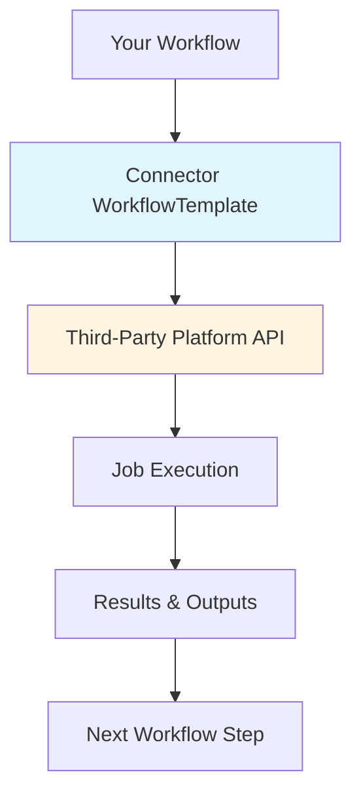

# What are Argo Connectors?

Argo Connectors is an **open-source, community-driven hub** of reusable WorkflowTemplates and ClusterWorkflowTemplates that enable you to integrate third-party data tools into your Argo Workflows without writing custom code.

**Think of it as the "Docker Hub for Argo Workflows"** - a central marketplace where the community discovers, shares, and maintains standardized integrations to popular data platforms.

## The Problem

When building data pipelines with Argo Workflows, teams typically face several challenges:

1. **Custom Integration Code**: Each team writes their own integration code for platforms like Databricks, Spark, Airflow, etc.
2. **Inconsistent Patterns**: Different implementations lead to different parameter formats, error handling, and monitoring approaches
3. **Maintenance Burden**: Each custom integration must be maintained, tested, and updated independently
4. **Steep Learning Curve**: New team members must learn both Argo Workflows and custom integration patterns

## The Solution

Argo Connectors provides pre-built, production-ready integrations that:

- **Standardize Integration Patterns**: Consistent parameter interfaces across all connectors
- **Reduce Time to Value**: Go from zero to running workloads in minutes
- **Enable Best Practices**: Built-in error handling, monitoring, and resource management
- **Support Multiple Interfaces**: Use with YAML or Python (via Hera SDK)

## The Community Model

### Open Contribution
Anyone can contribute connectors! Whether you're integrating with a popular platform like Snowflake or a niche internal tool, the community benefits from your contribution.

### Shared Maintenance
Popular connectors are maintained collectively by the community, ensuring they stay up-to-date with platform changes and evolving best practices.

### Quality Standards
All connectors follow shared standards for:
- Parameter naming conventions
- Error handling patterns
- Documentation requirements
- Testing coverage

### Discovery & Reuse
Browse the connector hub to find integrations for your stack - or contribute missing ones for others to use.

## How Connectors Work

Argo Connectors leverage Argo Workflows' native [WorkflowTemplate](https://argo-workflows.readthedocs.io/en/latest/workflow-templates/) feature to create reusable, parameterized workflow components.



### Example Flow

1. **Install Connector**: Deploy the WorkflowTemplate to your Kubernetes cluster
2. **Reference in Workflow**: Use `templateRef` to invoke the connector
3. **Pass Parameters**: Configure the job using standardized parameters
4. **Automatic Monitoring**: Connector handles job submission, monitoring, and result retrieval
5. **Use Outputs**: Access job results for subsequent workflow steps

## Connector Types

### WorkflowTemplate
Namespace-scoped templates that are available only within a specific namespace.

**Use when:**
- Working within a single namespace
- Different teams need different connector versions
- You want strict isolation between environments

```yaml
apiVersion: argoproj.io/v1alpha1
kind: WorkflowTemplate
metadata:
  name: databricks-connector
  namespace: ml-team
```

### ClusterWorkflowTemplate
Cluster-scoped templates available across all namespaces.

**Use when:**
- Sharing connectors across multiple teams
- Centralized management of connector versions
- Organization-wide standardization

```yaml
apiVersion: argoproj.io/v1alpha1
kind: ClusterWorkflowTemplate
metadata:
  name: databricks-connector
```

## Key Features

### 🔄 **Automatic Job Management**
Connectors handle the complete job lifecycle:
- Job submission to remote platform
- Status monitoring and polling
- Result retrieval
- Error handling and retries

### 📊 **Rich Output Parameters**
Extract job results as workflow parameters:
```yaml
outputs:
  parameters:
    - name: run-id
      value: "{{steps.databricks-job.outputs.parameters.run-id}}"
    - name: run-url
      value: "{{steps.databricks-job.outputs.parameters.run-url}}"
    - name: result
      value: "{{steps.databricks-job.outputs.parameters.result}}"
```

### 🔌 **Composable Architecture**
Chain multiple connectors in a single workflow:
```yaml
steps:
  - - name: ingest-data
      templateRef:
        name: databricks-connector
  - - name: train-model
      templateRef:
        name: databricks-connector
  - - name: batch-inference
      templateRef:
        name: spark-connector
```

### 🐍 **Python SDK Support**
All connectors work seamlessly with the [Hera](https://github.com/argoproj-labs/hera) Python SDK:

```python
from hera.workflows import Workflow, Steps, Step, TemplateRef

with Workflow(
    generate_name="pipeline-",
    namespace="default",
    entrypoint="main"
) as w:
    with Steps(name="main"):
        Step(
            name="databricks-job",
            template_ref=TemplateRef(
                name="databricks-connector",
                template="run-job",
                cluster_scope=False,
            ),
            arguments={
                "code-path": "/path/to/notebook",
                "cluster-mode": "New",
            }
        )

w.create()
```

## What Makes Argo Connectors Different?

| Feature | Argo Connectors | Custom Integration | Platform-Specific Operators |
|---------|----------------|-------------------|----------------------------|
| **Built By** | Community | Your team | Platform vendor |
| **Installation** | Single YAML apply | Custom development | Operator deployment + CRDs |
| **Maintenance** | Community-maintained | Each team maintains | Operator version management |
| **Discoverability** | Central hub | Tribal knowledge | Per-platform docs |
| **Argo Integration** | Native WorkflowTemplates | Custom steps/containers | External CRDs |
| **Learning Curve** | Consistent patterns | Custom per team | New APIs to learn |
| **Multi-Platform** | Unified interface | Different per platform | Different operator per platform |
| **Hera Support** | Built-in | Manual integration | Limited support |
| **Ecosystem** | Growing with community | Static | Vendor-controlled |

## Getting Involved

### For Users
- **[Get Started](../getting-started/README.md)**: Install your first connector
- **[Core Concepts](../core-concepts/README.md)**: Learn about WorkflowTemplates and parameters
- **[Connectors](../connectors/README.md)**: Explore available connectors
- **[Architecture](architecture.md)**: Deep dive into how connectors work

### For Contributors
- [Contributing Guide](CONTRIBUTING.md) - Learn how to build and submit connectors
- **[Community Discussions](https://github.com/pipekit/argo-connectors/discussions)**: Share ideas and get help

## Roadmap

### Current Connectors (Maintained by Pipekit)
- ✅ Databricks
- ✅ Apache Spark

### Community Wishlist
Vote on or contribute these connectors:
- ❄️ Snowflake
- 🔧 dbt (Data Build Tool)
- 🌊 Airflow Integration
- 📊 Fivetran
- 🔄 Great Expectations
- 📈 BI Tools (Looker, Mode, Tableau)
- 🗄️ Database Connectors (PostgreSQL, MongoDB, etc.)
- ☁️ Cloud Storage (S3, GCS, Azure Blob)

[→ See Full Roadmap & Contribute](https://github.com/pipekit/argo-connectors/discussions/categories/roadmap)
